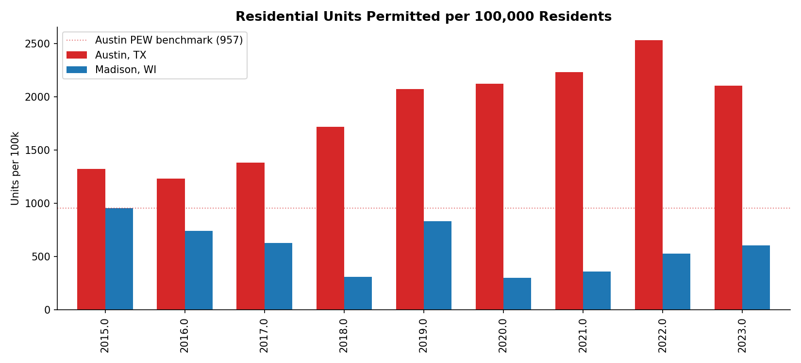
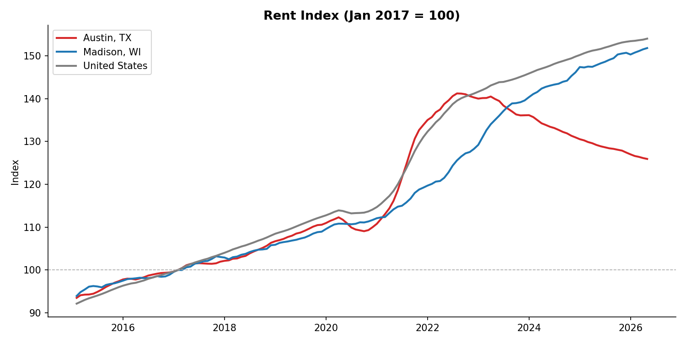
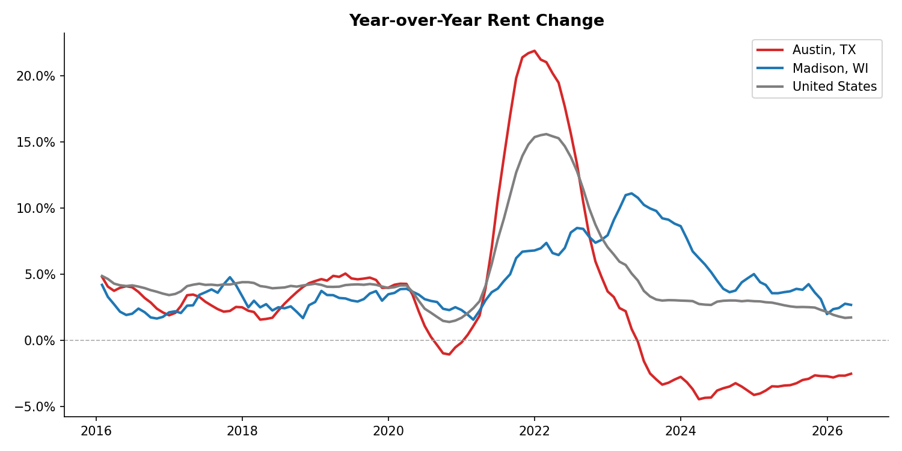
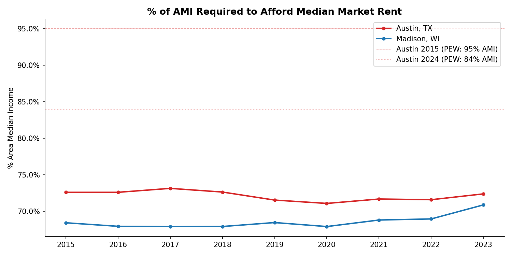
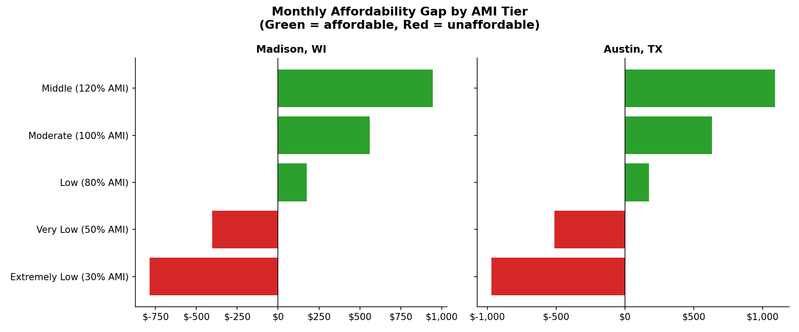
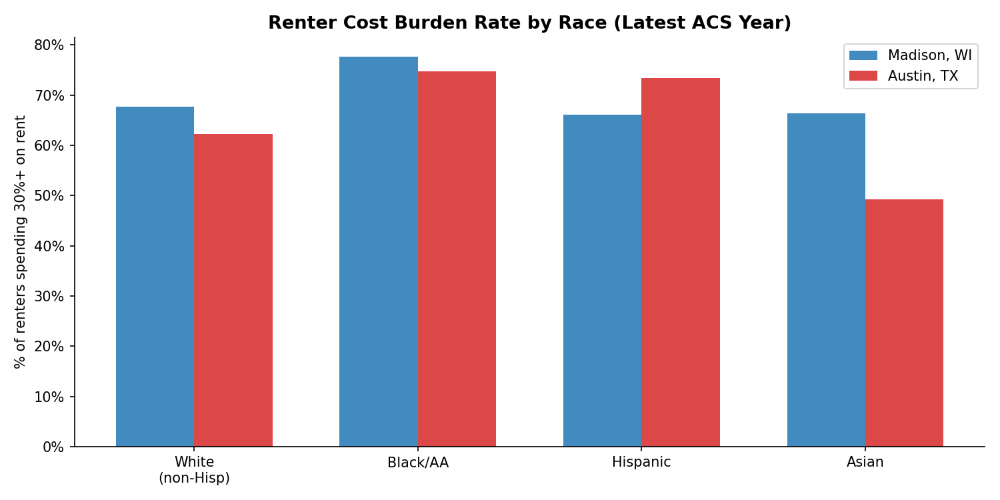

# Madison Housing Study: A Comparative Analysis with Austin, Texas

*Prepared: June 02, 2026*
*Adapted from: PEW Trusts, "Austin's Surge of New Housing Construction Drove Down Rents" (March 2026)*

---

## 1. Executive Summary

This report examines Madison, Wisconsin's housing affordability crisis and tests whether the
supply-led policy approach that lowered rents in Austin, Texas could achieve similar outcomes
in Madison. Using Census ACS data (2015–2023), Zillow ZORI rent indices, and city permit
records, we track rents, construction activity, cost burden rates, and racial equity gaps for
both cities.

**Key preliminary findings:**
- Austin required 72% AMI (2023) to afford median market rent; Madison required 71% AMI (2023).
- Austin permitted 2289 units/100k residents (2021-23 avg); Madison permitted 498 units/100k residents (2021-23 avg).
- Austin's rent fell to 4% below the U.S. median by January 2026 after a supply surge (PEW).
- Madison's cost burden rate and permitting trajectory are analyzed in detail below.

---

## 2. Background: Housing Context

### Austin
Austin's median rent rose 93% between 2010 and 2019, driven by rapid population growth
and constrained supply. Beginning around 2015, Austin undertook a sustained series of
regulatory reforms — reducing permitting timelines, expanding density bonuses, and ultimately
eliminating single-family-only zoning in 2023. The result was 120,000 new units from 2015–2024
and a permitting rate nearly 3× the national peer average. By 2025–2026, median rents had
declined to below the U.S. median.

### Madison
Madison faces a structurally similar challenge: a growing university-anchored population, a
historically constrained housing supply, and significant racial disparities in cost burden.
Unlike Austin, Madison has not pursued aggressive upzoning, and its permitting rate lags
substantially. This report quantifies that gap and projects what a supply-surge scenario might
mean for Madison renters.

---

## 3. Supply: How Much Did Each City Build?

See `data/construction_annual.csv` and `data/construction_cumulative.csv` for full breakdowns
by unit type (single-family, small multifamily, large multifamily).

**Austin benchmark (PEW):** 957 apartment permits per 100,000 residents (2021–2023).
This was ~2.8× the rate of peer city San Antonio (346/100k).

---

## 4. Rents: Did Supply Affect Affordability?

The PEW study documents a clear inflection: Austin's rent growth peaked in 2022 and then
reversed sharply as new supply came online. Class C (older, workforce) rents declined 11%
in 2023–2024 — the segment most critical for low-income renters.

Madison's rent trajectory and its relationship to construction activity are shown above.

---

## 5. Who Bears the Burden? Racial Equity

Cost burden is not evenly distributed. Black/AA and Hispanic renters consistently face higher
cost burden rates than white non-Hispanic renters in both cities. This section examines whether
Madison's racial equity gap is larger or smaller than Austin's and how supply expansion
interacted with these disparities.

See `data/racial_equity.csv` for full ACS B25106 breakdowns.

---

## 6. Policy Comparison: Austin vs. Madison

| Policy Dimension              | Austin, TX                                     | Madison, WI                               |
|-------------------------------|------------------------------------------------|-------------------------------------------|
| Zoning reform                 | Eliminated single-family-only zoning (2023)    | ADU reform passed; MF still restricted    |
| Permitting speed              | Reduced avg. timeline ~30%                     | Varies; no formal timeline targets        |
| Density bonus programs        | Multiple active programs                       | Limited; primarily downtown               |
| Affordable set-asides         | Voluntary (SMART Housing)                      | Inclusionary zoning ordinance             |
| MF permits per 100k (2021-23) | 957                                            | See permitting_rate.csv                   |

---

## 7. Recommendations for Madison

Based on the Austin case study and Madison's current conditions:

1. **Accelerate multifamily permitting** — Target a permitting rate of at least 400 units/100k
   residents within 3 years (current Austin benchmark: 957).
2. **Expand missing middle zoning** — Allow 2–4 unit buildings by-right citywide (currently
   limited to specific districts).
3. **Set permitting timeline targets** — Austin reduced average permit timelines ~30%; Madison
   should publish and track similar metrics.
4. **Protect existing affordable stock** — Supply-led growth benefits market-rate renters first;
   pair with anti-displacement measures and preservation of naturally affordable units.
5. **Track equity outcomes explicitly** — Monitor cost burden by race annually to ensure
   supply growth reduces, not widens, racial gaps.

---

## 8. Methodology Notes

- **Rent data:** Zillow ZORI (smoothed, seasonally adjusted), indexed to January 2017 = 100.
- **Income/population data:** ACS 5-Year Estimates, vintages 2015–2023.
- **Permits:** City of Madison Open Data (Socrata) and City of Austin Open Data.
- **Cost burden:** ACS table B25070 (all renters); racial breakdown from B25106.
- **AMI affordability threshold:** Annual rent ÷ 0.30 ÷ area median income × 100.
- **PEW benchmarks:** All Austin-specific statistics cited from PEW Trusts (March 2026) and
  are used as comparison baselines; they are not independently recalculated here.

---

*Data files: `data/` | Charts: `viz/` | Source code: `analysis/`, `data/`*
